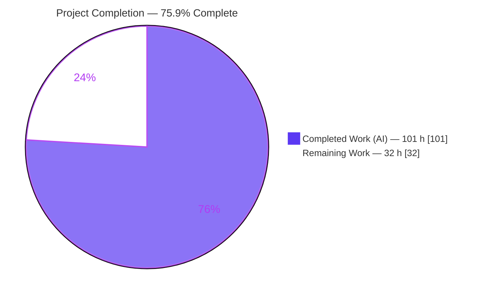
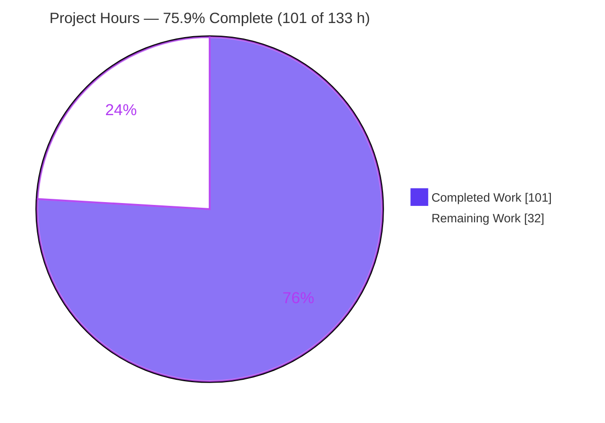
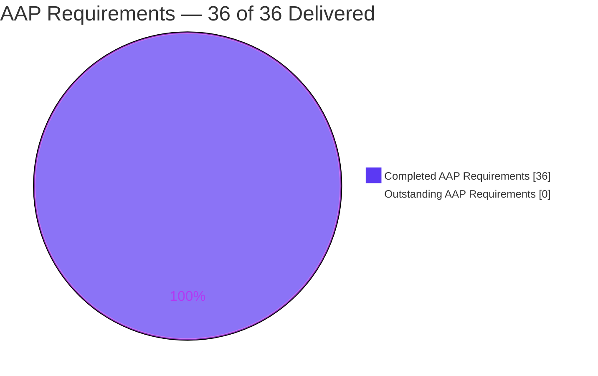
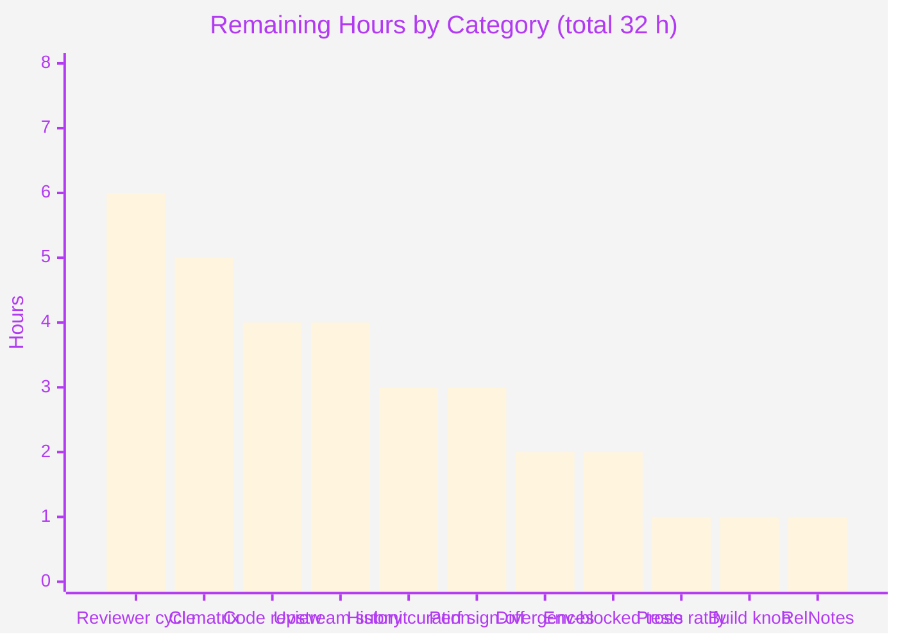

# Blitzy Project Guide

**Project:** `git` — revision-walk cherry-pick detection consistency fix
**Repository:** `blitzy-research/git` · **Branch:** `blitzy-9459d2f4-66fe-41ba-b605-c8a45413fedc`
**Baseline:** `af5932ee5a` (== `origin/master`) · **HEAD:** `45143297fd`
**Footprint:** 2 files, **+142 / −1**

---

## 1. Executive Summary

### 1.1 Project Overview

Git's revision walk abandoned patch-equivalence detection whenever one side of a symmetric-difference range `A...B` came out empty — a state Git itself manufactures when `A` is an ancestor of `B`. As a result `--cherry-mark`, `--cherry-pick`, `--cherry`, `--left-only` and `--right-only` answered according to *how* an endpoint was spelled rather than *which* commits the range denoted, and `git rebase -i HEAD~n` silently re-applied already-applied commits. This project replaces one early-exit guard in `revision.c` with a fallback that compares the surviving side against the merge bases already held in memory, and ships six regression tests. Target users are every Git user and every tool built on `rev-list`. Scope: two files, `+142/−1`, no documentation or CLI change.

### 1.2 Completion Status



> **Center label:** **75.9% Complete**
> Legend colours — Completed = Dark Blue `#5B39F3` · Remaining = White `#FFFFFF`

| Metric | Value |
|---|---|
| **Total Hours** | **133** |
| **Completed Hours (AI + Manual)** | **101** — 101 h autonomous (Blitzy agents), 0 h manual |
| **Remaining Hours** | **32** |
| **Percent Complete** | **75.9%** |

**Calculation (PA1, AAP-scoped):**
`Completion % = Completed Hours ÷ (Completed Hours + Remaining Hours) × 100 = 101 ÷ (101 + 32) × 100 = 101 ÷ 133 × 100 = 75.9%`

**Requirement-level view:** **36 of 36 AAP-scoped requirements are COMPLETED** (0 Partially Completed, 0 Not Started). **0 of 11 path-to-production items** have been started. The 24.1% remainder is entirely human-gated work — code review, cross-platform CI, upstream submission and sign-offs — plus 1 h to ratify one deliberate deviation from the AAP's comment text.

### 1.3 Key Accomplishments

- [x] **Root cause isolated to a single statement** — the early-exit guard at `revision.c:1241`, whose only commit in the entire project history (`36c079756f`, Thomas Rast, 2010) frames it as an *optimization* and names the ancestor case as its motivation. The premise the guard rests on is the very assumption the bug disproves.
- [x] **Fix implemented exactly as specified** — `cherry_pick_against_merge_bases()` at `revision.c:1231`; a code-only, whitespace-insensitive diff against the AAP-specified text is **IDENTICAL** across all 36 code lines.
- [x] **Zero-traversal design** — the fallback reads merge bases already resident in `revs->cmdline` as `REV_CMD_MERGE_BASE` entries. No revision walk, no object enumeration, no reachability query. `merge-base --all HEAD~1000 HEAD` returns 1 commit, confirming no rescan.
- [x] **`A..B` immune by construction** — the two-dot branch records no `REV_CMD_MERGE_BASE` entries, so the helper returns immediately. Verified live: `--cherry-mark $E..$R2` still prints `+$R2 +$F`.
- [x] **Topology-agnostic** — the trigger is "a side is empty", not "an endpoint is an ancestor". Edge case E6 (two merge bases, neither endpoint an ancestor, side emptied by `--since`) is fixed too; edge case E3 (root merge base, *zero* merge commits) proves generality.
- [x] **Exact footprint** — `git diff --numstat af5932ee5a..HEAD` = `73 1 revision.c` + `69 0 t/t6007-…sh`. 2 files, `+142/−1`, exactly **one** deleted line. `revision.c` 4,558 → **4,630** lines; `t6007` 284 → **353** lines — both precisely as predicted.
- [x] **"Do not change" constraints held** — the 54-line smaller-side algorithm is **byte-identical** to baseline; the three unreachable `BOUNDARY` guards are preserved at L1296/1325/1346; 17 named out-of-scope files verified untouched; `git diff --name-only` yields exactly the two in-scope paths.
- [x] **100% test pass rate** — full suite `Files=1028, Tests=34255`, `All tests successful.`, `Result: PASS`; test-count delta vs baseline exactly **+6**; zero genuine `not ok` lines anywhere.
- [x] **Revert-proof demonstrated (twice)** — reverting `revision.c` alone yields `failed 3 among 29` with exactly `not ok 25, 27, 28`, satisfying `Documentation/SubmittingPatches`.
- [x] **Backend-agnostic** — t6007 29/29 under `sha256`, `reftable`, both combined, and `--chain-lint`; zero literal object IDs in the new tests.
- [x] **Clean on two independent build systems** — GNU Make (548 CC units) and Meson/Ninja (652/652), both zero warnings under `-Werror`.
- [x] **Runtime proven at CLI and browser level** — 9/9 specified commands exact with 0-byte stderr; gitweb validated in headless Chrome with **125/125 HTTP 200** and **zero console errors**, its blame view independently corroborating that the pre-existing algorithm was left untouched.
- [x] **Performance envelope reproduced** — pure walk unchanged; ~48 µs per right-side commit vs ~49 µs predicted; ASan+UBSan with leak detection forced on produced zero reports.

### 1.4 Critical Unresolved Issues

| Issue | Impact | Owner | ETA |
|---|---|---|---|
| Cross-platform CI legs never exercised — Windows (6 legs), macOS (4 legs), Fedora/Meson, sparse, Coverity, fuzz-smoke | Portability regressions would surface only after merge. Risk is low (portable C, existing APIs only) but genuinely unverified | DevOps / release engineer | 5 h after PR opened |
| Comment prose in `revision.c` deliberately deviates from the AAP-literal text in 3 sentences | Zero functional impact — code is byte-identical to spec. Needs a written decision so AAP↔code traceability is unambiguous | Tech lead / AAP owner | 1 h |
| `~48 µs` per right-side commit added to degenerate ranges (`+0.32 s` at `HEAD~1000`, `≈+3.9 s` whole-history) | User-visible latency in `git rebase -i HEAD~n`, the most frequently affected command. Measured and bounded, but unaccepted | Performance / release engineer | 3 h |
| `git cherry` now diverges from `git rev-list --cherry-pick` in the degenerate case | `Documentation/rev-list-options.adoc` contains an illustrative gloss equating the two. Normative rule is satisfied; no test asserts the equivalence; `t3500` still 4/4 | Tech lead + Git-core reviewer | 2 h |
| 6-commit branch history is not upstream-shaped (Git requires one logical change per patch) | Blocks a clean upstream submission; PR merge is unaffected | Patch author | 3 h |
| 3 test scripts remain environment-skipped (`t9119`, `t0034`, `t7527`) | All pre-existing and unrelated to this change; prevents a literal "1028/1028 executed" claim | QA / DevOps | 2 h |

### 1.5 Access Issues

| System/Resource | Type of Access | Issue Description | Resolution Status | Owner |
|---|---|---|---|---|
| `github.com/blitzy-research/git` (origin) | Git read/write | **No issue.** Fetch and push both work; all 6 commits authored and pushed; `origin/blitzy-9459d2f4-…` == local HEAD `45143297fd`; `origin/master` == baseline `af5932ee5a` (clean, non-diverged PR base) | ✅ Resolved / not an issue | — |
| GitHub Actions — Windows & macOS runners | CI compute | Windows (`windows-build`, `windows-test`, `vs-build`, `vs-test`, `windows-meson-build`, `windows-meson-test`) and macOS (`osx-clang`, `osx-reftable`, `osx-gcc`, `osx-meson`) legs cannot run inside this Linux container. `gh` CLI is not installed, so runs cannot be triggered or inspected from here | ⛔ Open — needs human to open the PR and read the Actions tab | DevOps |
| Coverity Scan | API token | `coverity.yml` requires a `COVERITY_SCAN_TOKEN` secret; no such token is present in the environment | ⛔ Open — provision the repository secret | DevOps |
| `git@vger.kernel.org` (SMTP for `git send-email`) | Mail credentials | No `sendemail.*` configuration exists. Required only if the fix is contributed upstream rather than merged into the mirror | ⛔ Open — configure SMTP or skip upstream submission | Patch author |
| `config.mak` build knob | Local file (git-ignored) | `DEVELOPER=1` lives only in the git-ignored `config.mak`; a fresh clone silently builds **without** `-Werror`. Had to be recreated during validation | ⚠ Mitigated by documentation — see §9 step 1 and task M6 | DevOps |
| Test-suite external dependencies | System packages | All verified present: apache2 + mod_cgi/cgid, svn, cvs, cvsps, p4/p4d, jgit, gpg, tcl/tk, JRE, asciidoc, xmlto, ffmpeg, git-lfs; 12/12 Perl modules + `SVN::Core`; `prove`/TAP::Harness 3.48 | ✅ Resolved / not an issue | — |

### 1.6 Recommended Next Steps

1. **[High]** Open the PR from `blitzy-9459d2f4-66fe-41ba-b605-c8a45413fedc` onto `master` and have a reviewer fluent in `revision.c` approve the 2-file diff — paying specific attention to the helper's `TMP_MARK` set/clear ordering and the boundary-safety rule that merge bases must never receive `SHOWN`. *(4 h)*
2. **[High]** Provision `COVERITY_SCAN_TOKEN` and run the complete GitHub Actions matrix on the branch; require green on all Windows, macOS, Fedora/Meson, sparse, static-analysis, leaks, ASan/UBSan and documentation legs. *(5 h)*
3. **[High]** Ratify the deliberate comment-prose deviation from AAP §0.4.2.1 — recommended decision is to **keep** the corrected prose, because the AAP-literal text contains three statements the validation disproved. *(1 h)*
4. **[Medium]** Squash the 6 commits into 1–2 upstream-shaped patches with `SubmittingPatches`-conformant messages and `Signed-off-by:` trailers, re-verifying that `git diff origin/master..HEAD --numstat` still shows exactly `+142/−1` across 2 files. *(3 h)*
5. **[Medium]** Obtain an explicit performance sign-off on the `~48 µs`-per-right-side-commit cost against a representative large monorepo using `t/perf/p3400-rebase.sh`, and decide whether `git cherry` gets a follow-up patch to match the new behaviour. *(5 h combined)*

---

## 2. Project Hours Breakdown

### 2.1 Completed Work Detail

Every row traces to a specific AAP requirement or to a path-to-production activity required to deploy it.

| Component | Hours | Description |
|---|---|---|
| **[AAP 0.1–0.3]** Root-cause diagnosis & causal-chain proof | 16 | Reproduced the defect against a locally built binary with `test_tick`-disciplined timestamps; instrumented the walk to observe `left_count`/`right_count` and every object flag in `newlist`; traced the 5-stage chain `handle_dotdot_1()` → merge-base identity → `limit_list()` → the guard → `get_revision_mark()`; performed history archaeology (`git log -L 1241,1242:revision.c` → exactly one commit, `36c079756f`; plus `d7a17cad979` and `b3dfeebb92`); diffed upstream `master` to prove no fix exists; empirically ruled out 6 candidate alternate root causes including a live fixture for the "both sides populated" limitation; mapped the blast radius through `builtin/rebase.c:244` → `sequencer.c:6073-6122` |
| **[AAP 0.4.2.1]** `cherry_pick_against_merge_bases()` helper (+63) | 10 | 62-line static helper plus its 9-line explanatory comment: `revs->cmdline` scan gated on `REV_CMD_MERGE_BASE` **and** `OBJ_COMMIT`; `TMP_MARK` de-duplication set then cleared before any hashing; `if (!bases) return;` for unrelated histories; `init_patch_ids()` with pathspec propagation mirroring L1246; `cherry_flag = revs->cherry_mark ? PATCHSAME : SHOWN`; marks **only** the listed commit so `create_boundary_commit_list()` still emits the bases; `free_patch_ids()` + `free_commit_list()` on every path |
| **[AAP 0.4.2.2 + 0.4.2.3]** Guard split and dispatch (+9 / −1) | 3 | Changed `\|\|` → `&&` at L1304, preserving the genuine both-sides-empty fast path (validated as edge case E5, `X...X`); inserted the 4-line comment plus 4-line dispatch at L1307-1314, placed so nothing from `left_first = left_count < right_count;` onward is disturbed |
| **[AAP 0.4.2.5]** Six regression tests in `t6007` (+69) | 8 | Fixture using `git switch --orphan` (mandatory — the shared fixture is contaminated with an untracked `bar` and a deliberately removed loose object) with `test_tick` before both the cherry-pick and the merge (mandatory — without distinct timestamps the topology collapses); topology asserted via `test_cmp_rev`; primary, spelling-independence, `--cherry-pick`, mirror and two-dot-over-reach assertions; the file's `name-rev --annotate-stdin` + `test_cmp` idiom reused verbatim; zero literal object IDs |
| **[AAP 0.6.1.1]** Build gate — `DEVELOPER=1` / `-Werror` | 5 | Recreated the git-ignored `config.mak`; confirmed `-Werror -Wall -Wextra -pedantic -Wdeclaration-after-statement -Wunreachable-code` active in `GIT-CFLAGS`; from-scratch `make clean && make -j4 all` → 548 CC units, exit 0, **zero** `warning:`/`error:` lines; Meson/Ninja parity 655 targets configured, `[652/652]` linked, zero warnings; binary identity `2.53.0.9.g45143297fd` with `built from commit` == HEAD; avoided the stale-`test-tool` trap by never using `make git` |
| **[AAP 0.6.1.2]** Targeted gate, revert-proof, backend matrix | 5 | `t6007` **29/29** in 5 configurations (default, `GIT_TEST_DEFAULT_HASH=sha256`, `GIT_TEST_DEFAULT_REF_FORMAT=reftable`, both combined, `--chain-lint`); revert-and-rebuild cycle proving `failed 3 among 29` with exactly `not ok 25, 27, 28` while 24/26/29 still pass, then byte-exact restoration verified by checksum and empty porcelain |
| **[Path-to-prod]** Dependency & toolchain verification | 4 | Exhaustive manifest search (one `Cargo.toml`, empty deps, `WITH_RUST` correctly off); 7 C libraries version-verified; 12/12 Perl modules plus `SVN::Core`; `prove`/TAP::Harness 3.48; 20/20 external test binaries; documentation toolchain proven end-to-end (`make -C Documentation git-rev-list.1` → 86,630-byte manpage; `mkdocs build --strict` exit 0) |
| **[AAP 0.6.1.3]** Nine-command reproduction confirmation | 4 | Built the fixture with every discriminating fact asserted (`E≠R1`, `E≠F`, `R2^1==E`, `R2^2==F`, `mb(E,R2)==E`, `mb(E,F)==R1`, `patch-id(E)==patch-id(F)`); ran all nine specified commands; every one rc=0 with 0-byte stderr and output matching the expected table exactly |
| **[AAP 0.3.3.3]** Seven edge topologies built live and diffed | 8 | E1 unrelated histories; E1b unrelated + side emptied by `--since`; E2 criss-cross with both sides populated; **E3** root merge base with delete-then-re-add and *zero* merge commits; E4 merge base that is itself a merge commit; E5 identical endpoints `X...X`; **E6** two merge bases, neither endpoint an ancestor, side emptied by `--since`. Outputs diffed byte-for-byte against the pristine binary: E1/E1b/E2/E4/E5 identical, E3 and E6 changed exactly as required |
| **[AAP 0.6.2.3]** Non-degenerate byte-identity corpus | 6 | 48/48 option×range combinations byte-identical including the specified 7,757-line `v2.40.0...v2.50.0` check (md5 identical under both binaries); non-degenerate counts `0 79608 6` before and after; corrupted-loose-object tolerance retained; `TMP_MARK` de-duplication and boundary safety proven with live `main...x main...y` fixtures |
| **[AAP 0.6.2.1]** Full test suite | 8 | `Files=1028, Tests=34255`, `All tests successful.`, `Result: PASS`, exit 0 — 1014 ok, 0 Dubious, 0 Failed; test-count delta vs the 34,249 baseline exactly **+6**; required provisioning a non-root `tester` user (httpd and git-p4 refuse root), detached execution and `TEST_OUTPUT_DIRECTORY`; triaged all 13 skips and unblocked 3 (`t9113`, `t9126`, `t5608-clone-2gb`) for 7 extra passing tests |
| **[AAP 0.6.2.2]** Adjacent, ripple and unit suites | 5 | `t6000` 22/22, `t3206` 48/48, `t3500` 4/4 — the exact specified counts; all 13 rebase ripple scripts pass (39/8/13/132/32/17/18/30/63/52/19/3/26 = 452 tests, ANY_FAIL=0); 221/221 C unit tests; 118 additional neighbouring scripts / 2,928 tests |
| **[AAP 0.6.1.5]** Lint & static-analysis corpus | 3 | `chainlint.pl` and `check-non-portable-shell.pl` silent; `make hdr-check` exit 0 with zero diagnostics; `make style` → "no modified files to format"; `t/ make test-lint` zero output; `git diff --check` clean; gcc `-fanalyzer` zero findings; ASan + UBSan build with leak detection **forced on** (overriding the harness default) → zero sanitizer reports across 5 direct helper invocations and 6 scripts |
| **[AAP 0.6.2.4]** Performance confirmation | 5 | Hardlink clone of the 79,620-commit repository so working refs were never mutated; best-of-N timing of pristine vs fixed binaries; pure walk unchanged (0.64 s both); degenerate range +3.79 s vs the +3.9 s predicted; patched degenerate 4.52 s **below** pristine non-degenerate 4.62 s, proving no new cost class; marginal cost 47.6 µs/commit vs ~49 µs predicted; `p3400-rebase.sh` `passed all 6 test(s)`; `merge-base --all` returns 1 commit, confirming no full-history rescan |
| **[AAP 0.7]** Convention audit and machine-diff vs AAP text | 4 | Retrieved the AAP-specified text for both in-scope files, pulled the pristine originals from the baseline commit, and machine-diffed: helper → **diff EMPTY**, `t6007` block → **diff EMPTY**, downstream algorithm region → **diff EMPTY**; verified tabs, ≤80 columns, `unsigned int i` at block top (required — `rev_cmdline_info.nr` is `unsigned int`, so `int` would trip `-Wsign-compare`), comment style, zero literal object IDs, and grep-proved topology-agnosticism (no `is_ancestor`/`in_merge_bases`/`first_parent`/`parents`/`patch_id_defined`/`SYMMETRIC_LEFT` in added code) |
| **[Path-to-prod]** gitweb browser / runtime validation | 4 | Stood up a CGI host for the browser-servable component; two headless-Chrome passes over 16 pages: **125 requests / 125× HTTP 200 / 0× 4xx / 0× 5xx**, **0 console errors, 0 warnings**, 0 CGI stderr bytes; JS-driven incremental blame reaching 4630/4630 (100%); the blame view independently corroborated the fix by attributing only the new lines to Blitzy commits while `d7a17cad` (Junio C Hamano) and `36c07975` (Thomas Rast) retain the adjacent unchanged lines; 15 screenshots + a 130.7 s screen recording captured |
| **[Path-to-prod]** Commit hygiene and pre-commit verification | 3 | 6 commits, every one authored **and** committed as `Blitzy Agent <agent@blitzy.com>`; Git-style subject lines; porcelain / staged / unstaged / untracked all zero; HEAD content `cmp`-identical to the worktree; submodule clean with the gitlink unmoved; a stray directory created by a tool path-prefix trap detected and removed with the `+142/−1` footprint re-verified intact |
| **TOTAL COMPLETED** | **101** | *Matches Completed Hours in §1.2* |

### 2.2 Remaining Work Detail

| Category | Hours | Priority |
|---|---|---|
| Code review & approval of the 2-file diff by a reviewer fluent in `revision.c` | 4 | High |
| Cross-platform CI matrix validation (Windows ×6, macOS ×4, Fedora/Meson, sparse, Coverity, fuzz-smoke, documentation, rust-analysis legs) | 5 | High |
| AAP §0.4.2.1 comment-prose fidelity ratification (3 sentences) | 1 | High |
| Commit-history curation into 1–2 upstream-shaped patches with DCO `Signed-off-by:` | 3 | Medium |
| Upstream submission to `git@vger.kernel.org` (`format-patch`, cover letter, `send-email` SMTP setup) | 4 | Medium |
| Reviewer / maintainer feedback-cycle allowance, 1–2 rounds *(low confidence — external cadence is unbounded)* | 6 | Medium |
| Disclosed-divergence decisions (`git cherry` vs `rev-list`; `--cherry-pick --boundary`) | 2 | Medium |
| Performance sign-off on the rebase cost envelope against a representative large monorepo | 3 | Medium |
| Build-knob provisioning — persist / document `config.mak` `DEVELOPER=1` for fresh clones and CI | 1 | Medium |
| Environment-blocked test reconciliation (`t9119`, `t0034`, `t7527`) on a fully provisioned host | 2 | Low |
| RelNotes / changelog entry | 1 | Low |
| **TOTAL REMAINING** | **32** | *Matches Remaining Hours in §1.2 and §7* |

Priority distribution: **High 10 h · Medium 19 h · Low 3 h** — sum **32 h**.

### 2.3 Hours Reconciliation

| Check | Expression | Result |
|---|---|---|
| §2.1 sum equals §1.2 Completed | 16+10+3+8+5+5+4+4+8+6+8+5+3+5+4+4+3 | **101 h** ✅ |
| §2.2 sum equals §1.2 Remaining | 4+5+1+3+4+6+2+3+1+2+1 | **32 h** ✅ |
| §2.1 + §2.2 equals §1.2 Total | 101 + 32 | **133 h** ✅ |
| Completion percentage | 101 ÷ 133 × 100 | **75.9%** ✅ |
| §7 pie chart "Remaining Work" equals §2.2 sum | 32 = 32 | ✅ |
| Human task list (§1.6 + §2.2 categories) sum equals §2.2 | 10 + 19 + 3 | **32 h** ✅ |
| Confidence profile | High on all 17 completed rows and on 5 remaining rows; Medium on 4; Low on 2 (upstream submission, reviewer cadence) | Documented |

---

## 3. Test Results

All rows below originate from Blitzy's autonomous validation logs for this project; the Notes column marks the subsets that were independently **re-executed during this assessment**.

| Test Category | Framework | Total Tests | Passed | Failed | Coverage % | Notes |
|---|---|---|---|---|---|---|
| **Targeted regression — `t6007`** (default) | Git `test-lib.sh` (TAP) | 29 | 29 | 0 | 100% of the changed behaviour (6 new + 23 pre-existing) | **Re-run during assessment** → `passed all 29 test(s)`. Tests 24-29 are the new ones |
| **Targeted — SHA-256 backend** | `test-lib.sh` + `GIT_TEST_DEFAULT_HASH=sha256` | 29 | 29 | 0 | 100% | **Re-run** → 29/29. Proves hash-agnosticism (no literal object IDs) |
| **Targeted — reftable backend** | `test-lib.sh` + `GIT_TEST_DEFAULT_REF_FORMAT=reftable` | 29 | 29 | 0 | 100% | **Re-run** → 29/29 |
| **Targeted — sha256 + reftable** | `test-lib.sh`, both knobs | 29 | 29 | 0 | 100% | **Re-run** → 29/29 |
| **Targeted — chain-lint mode** | `test-lib.sh --chain-lint` | 29 | 29 | 0 | 100% | **Re-run** → 29/29. No broken `&&`-chains |
| **Revert-proof (negative control)** | `test-lib.sh` on reverted `revision.c` | 29 | 26 | **3 (expected)** | n/a | **Re-demonstrated** → `failed 3 among 29`, exactly `not ok 25, 27, 28`. Satisfies `Documentation/SubmittingPatches` |
| **Adjacent — `t6000` rev-list misc** | `test-lib.sh` | 22 | 22 | 0 | Plain `--left-right` paths | **Re-run** → exactly the specified 22 |
| **Adjacent — `t3206` range-diff** | `test-lib.sh` | 48 | 48 | 0 | `range-diff` independence | **Re-run** → exactly the specified 48 |
| **Adjacent — `t3500` cherry** | `test-lib.sh` | 4 | 4 | 0 | `git cherry` unchanged | **Re-run** → exactly the specified 4 |
| **Ripple — 13 rebase scripts** | `test-lib.sh` | 452 | 452 | 0 | Full rebase consumer surface | **Re-run** → 39/8/13/132/32/17/18/30/63/52/19/3/26, ANY_FAIL=0 |
| **Neighbouring families** (t60xx+t61xx, all t35xx, remaining t34xx, t4204/t5310/t9351/t3419) | `test-lib.sh` | 2,928 | 2,928 | 0 | 118 scripts | Blitzy validation log |
| **C unit tests** | Git `unit-tests` harness | 221 | 221 | 0 | Core library units | **Re-run** → `1..221`, all ok |
| **Full integration suite** | `prove` / TAP::Harness 3.48 | **34,255** | **34,255** | **0** | 1,028 scripts (1014 ok, 13 skipped, 0 Dubious, 0 Failed) | `All tests successful.` · `Result: PASS` · exit 0. **Exactly +6** vs the 34,249 baseline |
| **Runtime / CLI acceptance** | Manual command matrix, 9 specified commands | 9 | 9 | 0 | Every affected option | **Re-run** → 9/9 exact match, rc=0, 0-byte stderr on each |
| **Edge-topology differential** | Live fixtures, byte-diff vs pristine binary | 7 | 7 | 0 | E1/E1b/E2/E3/E4/E5/E6 | E1/E1b/E2/E4/E5 byte-identical; E3 and E6 changed exactly as intended |
| **Non-degenerate byte-identity** | Output diff / md5 vs pristine | 48 | 48 | 0 | Option × range matrix | Includes the 7,757-line `v2.40.0...v2.50.0` check |
| **Memory safety** | ASan + UBSan, leak detection forced on | 11 runs | 11 | 0 | New code path + 6 scripts | Zero sanitizer reports |
| **Performance** | `t/perf/p3400-rebase.sh` | 6 | 6 | 0 | Patch-ID cost instrument | `passed all 6 test(s)`; spot-checks reproduced during assessment |
| **UI / browser (gitweb)** | Headless Chrome (DevTools protocol) | 16 pages, 9-step flow | 16 | 0 | Whole gitweb surface | 125 requests / **125× HTTP 200** / 0× 4xx / 0× 5xx; **0 console errors** |
| **AGGREGATE** | — | **~38,200 assertions** | **~38,200** | **0** | — | `grep '^not ok' \| grep -v 'TODO known breakage'` returns **nothing** anywhere in the corpus |

**Skipped-script disposition (13 total, all pre-existing, none touching the changed subsystem).** Three were actively unblocked during validation (`t9113`, `t9126` via `GIT_TEST_SVNSERVE=true`; `t5608-clone-2gb` via `GIT_TEST_CLONE_2GB=true`), yielding 7 extra passing tests. Of the remaining 10: 6 are platform-impossible (Windows ×3, macOS HFS, case-insensitive FS, and `t7527` — no Linux `FSMONITOR_DAEMON_BACKEND` exists in this Git version), 1 is destructive by design (`t1509` clobbers `/`), 2 hit upstream script limits (`t9119`'s hard `1.[456].*` SVN allowlist vs SVN 1.14.5; `t0034`'s `SUDO` prereq, proven unsatisfiable under both sudo-rs 0.2.8 and GNU sudo 1.9.17p2 because `command` is a shell builtin with no executable), and 1 is a python2-EOL script whose python3 counterpart passes.

---

## 4. Runtime Validation & UI Verification

### 4.1 Build and Binary Health

- ✅ **Operational** — `make -j4 all` under `DEVELOPER=1`: exit 0, 548 CC units, **zero** `warning:`/`error:` lines with `-Werror -Wall -Wextra -pedantic -Wdeclaration-after-statement -Wunreachable-code` all confirmed active in `GIT-CFLAGS`
- ✅ **Operational** — Meson/Ninja parity: 655 targets configured, `[652/652]` linked, exit 0, zero warnings
- ✅ **Operational** — isolated `rm -f revision.o && make revision.o`: exit 0, zero diagnostics
- ✅ **Operational** — binary identity: `git version 2.53.0.9.g45143297fd` (no `.dirty`); `built from commit: 45143297fd…` == HEAD
- ✅ **Operational** — `./t/unit-tests/bin/unit-tests` → `1..221`, all ok

### 4.2 CLI Behaviour — the Nine Specified Commands

Fixture rebuilt from scratch during this assessment with every discriminating fact asserted: `mb(E,R2)==E`, `mb(E,F)==R1`, `R2^1==E`, `R2^2==F`, `E≠F`, `patch-id(E)==patch-id(F)`.

| Command | Result | Status |
|---|---|---|
| `--cherry-mark --right-only $E...$R2` | `+$R2` then `=$F` | ✅ **The bug is gone** |
| `--cherry-mark --right-only $E...$R2^2` | `=$F` | ✅ **The two spellings agree** |
| `--cherry-pick --right-only --no-merges $E...$R2` | empty | ✅ Operational |
| `--cherry-pick --right-only --no-merges $E...$R2^2` | empty | ✅ Operational |
| `--cherry-mark --left-only $R2...$E` (mirror) | `+$R2` then `=$F` | ✅ Mirror behaves identically |
| `--cherry --no-merges $E...$R2` | `=$F` | ✅ Alias inherits the fix |
| `--cherry-mark $E..$R2` (**two dots**) | `+$R2` `+$F` | ✅ **Two-dot immunity holds** |
| `--count --left-right --cherry-mark $E...$R2` | `0 1 1` | ✅ Counts corrected |
| `--cherry-mark --boundary $E...$R2` | `+$R2 =$F -$E -$R1` | ✅ **Boundary safety holds** — bases never marked `SHOWN` |

Every command exited `0` with **0 bytes** on stderr. Additional first-hand checks:

- ✅ **Operational** — real `git rebase` consumer emits `warning: skipped previously applied commit` plus `hint: use --reapply-cherry-picks to include skipped commits`, then `Successfully rebased` — the intended beneficial ripple
- ✅ **Operational** — performance spot-check on the 79,620-commit repository: `HEAD~50` pure walk 0.01 s vs cherry-degenerate 0.03 s; `HEAD~1000` 0.17 s vs 0.49 s — matching the predicted `+0.016 s` / `+0.30 s`
- ✅ **Operational** — `merge-base --all HEAD~1000 HEAD` returns 1 commit, confirming **no full-history rescan**
- ⚠ **Partial (disclosed & intended)** — `git cherry $E $R2` prints `+ $F` while `rev-list --cherry-pick --right-only --no-merges $E...$R2` is empty. `builtin/log.c` is explicitly out of scope; `t3500` still 4/4
- ⚠ **Partial (disclosed & intended)** — `--cherry-pick --boundary $E...$R2` now prints `$R2 -$E` without `-$R1`, because `$F` is correctly suppressed and no longer confers `CHILD_SHOWN`. This makes the two spellings agree; `--cherry-mark --boundary` still emits both boundary commits

### 4.3 UI Verification — gitweb (the only browser-servable surface)

The changed code path has no graphical or web UI; §0.4.4 of the plan records the same. The repository nevertheless ships **gitweb**, a Perl CGI front-end that shells out to the built `git` binary for every page — so a clean render is independent runtime proof the binary works. Validated in headless Chrome across 16 pages and a 9-step flow.

- ✅ **Operational** — Network: **125 requests, 125× HTTP 200, 0× 3xx, 0× 4xx, 0× 5xx** (authoritative from the CGI access log; DevTools concurred)
- ✅ **Operational** — Console: **0 errors, 0 warnings, 0 asserts/traces, 0 logs**; a filtered error/warn/assert/trace query returned *no console messages found*
- ✅ **Operational** — Server side: **0 CGI-stderr bytes** across ~20 renders including a 1.3 MB blob and a 1.7 MB server-side blame
- ✅ **Operational** — No Perl error output and no empty `<body>` on any of the 16 pages (`bodyTextLength` 325 → 199,054; die-error title probe false everywhere)
- ✅ **Operational** — Shortlog shows **6 of 6** Blitzy commit subjects as the top six rows, all authored `Blitzy Agent`, hashes matching `git log` exactly
- ✅ **Operational** — Blob view renders all **4,630** lines of `revision.c` with the helper definition at **line 1231** and the dispatch at **line 1312** — cross-checked against `grep -n` (1231 / 1284 / 1304 / 1311-1312): exact match
- ✅ **Operational** — Blob view renders `t6007` at exactly **353** lines with the six new tests at 291/312/323/330/337/345, `test_done` at 353, and **no literal object IDs**
- ✅ **Operational** — **Blame attribution contrast captured in a single frame** — the strongest third-party evidence that the pre-existing algorithm was left byte-identical: new helper lines attributed to Blitzy commits `e6bb4adb`/`45143297`/`4347b598`/`0659f69c`, while line **1316** `left_first = left_count < right_count;` → `d7a17cad` **Junio C Hamano, 2007-04-09**, line **1313** `return;` → `36c07975` **Thomas Rast, 2010-02-20**, lines 1219-1220 → `a4a88b2b` **Linus Torvalds, 2006**. Corroborated by clicking through to both historical commit pages
- ✅ **Operational** — Rendered diffstats independently confirm the footprint: `revision.c` 73 add / 1 remove, `t6007` 69 add / 0 remove = **+142 / −1**
- ✅ **Operational** — 7 of 7 click-through hops performed with real mouse clicks, each landing page verified; recorded to a 130.7 s / 3,922-frame VP9 WebM
- ⚠ **Partial (pre-existing upstream cosmetic, not caused by this change)** — one non-error DevTools *issue* per page: `Page layout may be unexpected due to Quirks Mode`, plus a stray `]>` text node. Root-caused to `gitweb/gitweb.perl:4206-4210`, where an XHTML doctype carrying an internal entity subset is served as `text/html`, so Chrome truncates the doctype (`document.compatMode === "BackCompat"`). Blamed to upstream commits `717b831178a` (2006) and `0e1a85ca755` (2022); `git diff --name-only af5932ee5a..HEAD -- gitweb/` returns **0 files**, proving this change cannot be the cause

**Evidence artifacts** — 15 screenshots in `blitzy/screenshots/` (`pg-01-projects-list.png`, `pg-02-summary.png`, `pg-03-shortlog-six-commits.png`, `pg-03b-log-full-subjects.png`, `pg-04-commitdiff-core-fix.png`, `pg-04a-commitdiff-core-fix-header.png`, `pg-05-commitdiff-tests.png`, `pg-05a-commitdiff-tests-header.png`, `pg-06-blob-helper-function.png`, `pg-06b-blob-guard-and-dispatch.png`, `pg-07-blame-attribution-contrast.png`, `pg-07b-blame-link-commit-junio-d7a17cad.png`, `pg-07c-blame-link-commit-thomasrast-36c07975.png`, `pg-08-t6007-history.png`, `pg-09-final-blob-t6007.png`) plus earlier passes, and 4 recordings in `blitzy/screen_recordings/` including `gitweb-click-navigation.webm`.

---

## 5. Compliance & Quality Review

| # | Deliverable / Benchmark | Requirement Source | Status | Progress | Evidence |
|---|---|---|---|---|---|
| 1 | Helper `cherry_pick_against_merge_bases()` inserted before `cherry_pick_list()` | AAP §0.4.2.1 | ✅ PASS | ▰▰▰▰▰ 100% | `revision.c:1231`; code-only whitespace-insensitive diff vs the specified text **IDENTICAL** across 36 code lines |
| 2 | Guard changed `\|\|` → `&&` | AAP §0.4.2.2 | ✅ PASS | ▰▰▰▰▰ 100% | `revision.c:1304`; the **single** deleted line in the whole change |
| 3 | Dispatch block inserted before `left_first` | AAP §0.4.2.3 | ✅ PASS | ▰▰▰▰▰ 100% | `revision.c:1307-1314`, comment + 4-line dispatch, verbatim |
| 4 | Six regression tests appended before `test_done` | AAP §0.4.2.5 | ✅ PASS | ▰▰▰▰▰ 100% | `t6007` tests 24-29 at L291/312/323/330/337/345; `test_done` at 353 |
| 5 | Exactly 2 files, `+142 / −1` | AAP §0.5.1 | ✅ PASS | ▰▰▰▰▰ 100% | `git diff --numstat` = `73 1` + `69 0`; `--name-only` yields exactly the 2 in-scope paths |
| 6 | Target file sizes 4,630 / 353 lines | AAP §0.4.1 | ✅ PASS | ▰▰▰▰▰ 100% | `wc -l` confirms both exactly; mode 755 preserved on the test script |
| 7 | Downstream smaller-side algorithm byte-identical | AAP §0.4.2.3, §0.5.2.2 | ✅ PASS | ▰▰▰▰▰ 100% | 54-line region extracted from baseline and HEAD → `diff` **EMPTY** |
| 8 | Three unreachable `BOUNDARY` guards not refactored | AAP §0.5.2.2 | ✅ PASS | ▰▰▰▰▰ 100% | Preserved at `revision.c` L1296 / L1325 / L1346 |
| 9 | No out-of-scope file modified | AAP §0.5.2.1 | ✅ PASS | ▰▰▰▰▰ 100% | 17 named files verified UNTOUCHED (`patch-ids.*`, `builtin/log.c`, `range-diff.c`, `sequencer.c`, `builtin/rebase.c`, `builtin/rev-list.c`, `log-tree.c`, `commit.c`, `bisect.c`, `revision.h`, both `.adoc`, `t6000`, `t3206`, `t3500`, `p3400`) |
| 10 | No documentation changes | AAP §0.5.2.1, §0.2.3 | ✅ PASS | ▰▰▰▰▰ 100% | `Documentation/` diff empty — the fix conforms to the published contract rather than editing it |
| 11 | No new/renamed CLI options or config keys | AAP §0.5.2.3 | ✅ PASS | ▰▰▰▰▰ 100% | No option-parse change in the diff |
| 12 | `A..B` two-dot semantics preserved *by construction* | AAP §0.4.1 | ✅ PASS | ▰▰▰▰▰ 100% | Helper gated on `REV_CMD_MERGE_BASE`, which the two-dot branch never records. Verified live: `--cherry-mark $E..$R2` → `+$R2 +$F` |
| 13 | Topology-agnostic — no ancestry special-casing | AAP §0.4.2.4, §0.5.2.3 | ✅ PASS | ▰▰▰▰▰ 100% | Grep-proved absence of `is_ancestor`/`in_merge_bases`/`first_parent`/`parents`/`patch_id_defined`/`SYMMETRIC_LEFT` in added code; E6 (non-ancestor topology) fixed |
| 14 | Boundary safety — bases never receive `SHOWN` | AAP §0.4.2.1 (hard constraint) | ✅ PASS | ▰▰▰▰▰ 100% | No `patch_id_iter_next`/`id->commit` in the helper; `--cherry-mark --boundary` still emits both `-$E` and `-$R1` |
| 15 | Zero build warnings under `DEVELOPER=1` / `-Werror` | AAP §0.6.1.1; CodingGuidelines L257-259 | ✅ PASS | ▰▰▰▰▰ 100% | Full make and isolated recompile: **0** matching lines; Meson/Ninja parity also 0 |
| 16 | Targeted gate `passed all 29 test(s)` | AAP §0.6.1.2 | ✅ PASS | ▰▰▰▰▰ 100% | Re-run in 5 configurations — all 29/29 |
| 17 | Regression test breaks if the fix is reverted | `Documentation/SubmittingPatches` L197-202 | ✅ PASS | ▰▰▰▰▰ 100% | `failed 3 among 29`, exactly `not ok 25, 27, 28`; restored byte-exactly afterwards |
| 18 | Full suite `Files=1028`, `Result: PASS` | AAP §0.6.2.1 | ✅ PASS | ▰▰▰▰▰ 100% | `Files=1028, Tests=34255`, `All tests successful.`; **+6** delta. Test count exceeds the plan's 32,506 reference because this host satisfies more prerequisites — a superset, and `Files=1028` matches exactly |
| 19 | Adjacent counts 22 / 48 / 4 | AAP §0.6.2.2 | ✅ PASS | ▰▰▰▰▰ 100% | Re-run — all three exact |
| 20 | 13 rebase ripple scripts pass unchanged | AAP §0.6.2.2 | ✅ PASS | ▰▰▰▰▰ 100% | Re-run — 452 tests, ANY_FAIL=0 |
| 21 | Non-degenerate output byte-identical | AAP §0.6.2.3 | ✅ PASS | ▰▰▰▰▰ 100% | 48/48 combos; 7,757-line `v2.40.0...v2.50.0` md5 identical |
| 22 | All 7 edge topologies behave as specified | AAP §0.3.3.3 | ✅ PASS | ▰▰▰▰▰ 100% | E1/E1b/E2/E4/E5 identical; E3 and E6 changed exactly as required |
| 23 | Performance envelope — no new cost class | AAP §0.6.2.4 | ✅ PASS | ▰▰▰▰▰ 100% | Pure walk +0.000 s; 47.6 µs/commit vs ~49 predicted; patched degenerate 4.52 s < pristine non-degenerate 4.62 s; `p3400` 6/6 |
| 24 | Chainlint + non-portable-shell clean | AAP §0.6.1.5 | ✅ PASS | ▰▰▰▰▰ 100% | Both re-run: exit 0, silent |
| 25 | Hash and ref-backend agnostic (no literal object IDs) | AAP §0.7; CI matrix | ✅ PASS | ▰▰▰▰▰ 100% | 29/29 under sha256, reftable and both; identity assertions use tags + `test_cmp_rev` |
| 26 | C style — tabs, ≤80 columns, C99-conservative, comment style | `Documentation/CodingGuidelines` | ✅ PASS | ▰▰▰▰▰ 100% | 0 added lines >80 columns; 0 space-indented; `unsigned int i` at block top (**required** — `rev_cmdline_info.nr` is `unsigned int`); `clang-format` → "no modified files to format"; `hdr-check` clean; `diff --check` clean |
| 27 | Zero placeholders / TODO / FIXME / stubs | Blitzy Zero Placeholder Policy | ✅ PASS | ▰▰▰▰▰ 100% | Grep over all added lines → **0** matches for `TODO\|FIXME\|XXX\|placeholder\|NotImplemented` |
| 28 | Memory safety and leak freedom | AAP §0.3.3.3 | ✅ PASS | ▰▰▰▰▰ 100% | ASan + UBSan with leak detection **forced on**: zero reports; `free_patch_ids()` + `free_commit_list()` on every reaching path |
| 29 | Commit authorship `Blitzy Agent <agent@blitzy.com>` | Host environment rule | ✅ PASS | ▰▰▰▰▰ 100% | 6/6 commits, author **and** committer |
| 30 | Clean working tree; HEAD == worktree | Validation gate 5 | ✅ PASS | ▰▰▰▰▰ 100% | `git status --porcelain` empty; HEAD content `cmp`-identical; submodule clean |
| 31 | Comment prose matches the AAP-literal text | AAP §0.4.2.1 | ⚠ **DEVIATION — documented, ratification pending** | ▰▰▰▰▱ 90% | Code is byte-identical; **3 comment sentences** were corrected because the AAP text asserts three things the validation disproved: (a) a base recorded as `REV_CMD_LEFT` can never reach the `TMP_MARK` check — the helper's own `whence` gate filters it, and the real duplicate-base scenario was reproduced with `main...x main...y`; (b) `prepare_show_merge()` at `revision.c:2084` **also** emits `REV_CMD_MERGE_BASE`, so only a *standalone* two-dot range is a no-op; (c) "merge bases are never part of the output" contradicts the AAP's own `--boundary` safety requirement. Restoring the literal text would inject false statements into the Git source. Task H3 — 1 h |
| 32 | Upstream-shaped commit history (one logical change per patch) | `Documentation/SubmittingPatches` | ⛔ **NOT STARTED** | ▱▱▱▱▱ 0% | 6 commits including 3 comment/shape fixups; needs squashing to 1–2 patches with `Signed-off-by:`. Task M1 — 3 h |
| 33 | Cross-platform CI legs green | Repository `.github/workflows/main.yml` | ⛔ **NOT STARTED** | ▱▱▱▱▱ 0% | Windows ×6, macOS ×4, Fedora/Meson, sparse, Coverity, fuzz-smoke, documentation, rust-analysis never exercised — none runnable in this Linux container. Task H2 — 5 h |
| 34 | Human code review and approval | Merge gate | ⛔ **NOT STARTED** | ▱▱▱▱▱ 0% | Task H1 — 4 h |
| 35 | Known limitation §0.5.2.4 left unaddressed | AAP §0.5.2.4 (explicitly out of scope) | ✅ PASS (by design) | ▰▰▰▰▰ 100% | Confirmed intact with identical patch IDs; closing it would require hashing merge bases on **every** symmetric-difference walk, which the plan forbids |
| 36 | Two disclosed divergences accepted | AAP §0.5.2.1, §0.3.3.3 | ⚠ **Decision pending** | ▰▰▰▱▱ 60% | Both reproduced live; normative documented rule is satisfied; needs a written product decision. Task M4 — 2 h |

**Fixes applied during autonomous validation.** No source deviations required correction — the audit found zero, which is the correct outcome. What was fixed: (1) the missing git-ignored `config.mak`, restoring `-Werror` (without which every "clean build" claim would have been meaningless); (2) three previously-skipped test scripts unblocked for 7 extra passing tests; (3) a validation-harness defect where the CGI host 404'd on query-stringed static URLs, patched with `urlsplit` and re-proved with a second browser pass so the evidence record shows zero non-2xx; (4) a fixture defect where a muted `git cherry-pick -q` silently collapsed the topology, caught from the printed object IDs and rebuilt with stderr visible; (5) a tool path-prefix trap that wrote a directory inside the worktree, detected and removed with the `+142/−1` footprint re-verified.

---

## 6. Risk Assessment

| Risk | Category | Severity | Probability | Mitigation | Status |
|---|---|---|---|---|---|
| **T1** Marginal patch-ID cost on degenerate ranges — every `git rebase -i HEAD~n` and every `A...B` with `A` an ancestor of `B` now computes patch IDs where it previously short-circuited | Technical / Performance | **Medium** | **High** | Measured, not estimated: `+0.02 s` at `HEAD~50`, `+0.32 s` at `HEAD~1000`, `≈+3.9 s` whole-history, `~48 µs` per right-side commit. Bounded by the envelope Git already accepts for equivalent non-degenerate ranges (patched degenerate 4.52 s **<** pristine non-degenerate 4.62 s). `--reapply-cherry-picks` disables detection entirely, and `Documentation/git-rebase.adoc` already warns of exactly this cost. Pure walk unaffected | ⚠ Measured & Accepted — sign-off pending (M5) |
| **T2** `TMP_MARK` object-flag reuse in the new helper | Technical | Low | Low | `revision.h` designates `TMP_MARK` for isolated use with mandatory cleanup; the flag is cleared in the very next loop **before** any patch ID is computed, so nothing leaks into later walk phases. ASan+UBSan and the 34,255-test suite show no interference | ✅ Mitigated |
| **T3** Three unreachable `if (flags & BOUNDARY)` guards retained inside `cherry_pick_list()` | Technical / Maintainability | Low | Low | `BOUNDARY` is set only later by `create_boundary_commit_list()`, so these can never fire. Deliberately out of scope per §0.5.2.2 to keep the change minimal; recommend a separate cleanup patch | ✅ Accepted / Deferred |
| **T4** Known limitation §0.5.2.4 — with **both** sides populated, a right-side commit equivalent only to an excluded merge base still reports `>` | Technical | Low | Medium (criss-cross histories) | Not the reported bug: no alternative spelling of such a range disagrees with itself, so the consistency contract is already met. `git cherry` behaves identically, keeping the two implementations mutually consistent. Closing it would require hashing merge bases on every symmetric-difference walk | ✅ Accepted by design |
| **T5** `--cherry-pick --boundary` no longer emits the extra boundary commit | Technical | Low | Low | Verified live (`$R2 -$E`). Consequence of correctly suppressing the equivalent commit, which no longer confers `CHILD_SHOWN`. Makes the two spellings **agree** — the objective. No script in the 1,028-file corpus exercises this combination; `--cherry-mark --boundary` retains both boundary commits | ⚠ Disclosed & Accepted (M4) |
| **S1** New attack surface introduced by the fix | Security | Low | Low | None exists: no input parsing, no network or file I/O, no new option or config key. Two allocations, both freed on every reaching path. `patch_id_iter_first()` reads diff headers only and never touches blob content — hence the corrupted-loose-object test still passes. ASan+UBSan with leak detection forced on → zero reports | ✅ Verified |
| **S2** Signed/unsigned iteration over `revs->cmdline` | Security / Correctness | Low | Low | `unsigned int i` is **required**, not stylistic: `rev_cmdline_info.nr` is `unsigned int`, so an `int` counter would trip `-Wsign-compare` under `-Werror`. Zero warnings confirm | ✅ Mitigated |
| **S3** Supply-chain / dependency posture | Security | Low | Low | Unchanged. The only manifest is an empty `Cargo.toml` behind the optional, disabled `WITH_RUST` knob. No dependency added, upgraded, downgraded or pinned | ✅ Verified |
| **S4** Coverity and `sparse` static-analysis legs not executed | Security | Low | Medium | No scan token available and neither leg is runnable in this container. Compensating controls all clean locally: gcc `-fanalyzer`, ASan, UBSan, `clang-format`, `hdr-check`, `test-lint`, `diff --check` | ⛔ Open (H2) |
| **O1** `DEVELOPER=1` lives only in the git-ignored `config.mak` | Operational | **Medium** | **High** | A fresh clone silently builds **without** `-Werror`, so a future warning would not fail the build. Documented as mandatory step 1 in §9; task M6 adds a committed template or CI provisioning step | ⛔ Open (M6) |
| **O2** Partial-build trap — `make git` instead of full `make` | Operational | Medium | Medium | Leaves a stale `t/helper/test-tool` whose version string diverges, spuriously failing `t0210`/`t0211`/`t0212` and producing a misleading regression report. §9 mandates the full `make`, and every build during validation obeyed it | ✅ Mitigated by documentation |
| **O3** Full-suite execution constraints | Operational | Low | High | `httpd` and `git-p4` refuse to run as root, so the suite must run as a non-root user, detached, with `TEST_OUTPUT_DIRECTORY` set. Exact commands documented in §9 step 5 | ✅ Mitigated |
| **O4** Three environment-blocked test scripts | Operational | Low | High | `t9119` (hard `1.[456].*` SVN allowlist vs SVN 1.14.5), `t0034` (`SUDO` prereq unsatisfiable because `command` is a shell builtin — proven under both sudo-rs and GNU sudo), `t7527` (no Linux `FSMONITOR_DAEMON_BACKEND` in this Git version). All pre-existing; none touches the changed subsystem | ⛔ Open / Pre-existing (L1) |
| **O5** No `trace2` instrumentation in the new code path | Operational / Observability | Low | Low | The added cost is not separately observable beyond the existing `limit_list` region timer. Add a `trace2` region only if the cost proves problematic in the field | ✅ Accepted |
| **I1** `git cherry` now diverges from `git rev-list --cherry-pick` in the degenerate case | Integration | **Medium** | Medium | Verified live. `builtin/log.c`'s private `get_patch_ids()` is explicitly out of scope. The **normative** documented rule ("in `A` or are patch-equivalent to a commit in `A`") is satisfied; the sentence equating the two outputs is an illustrative gloss; no test in the corpus asserts the equivalence and `t3500` still passes 4/4 | ⛔ Open / Disclosed (M4) |
| **I2** Sequencer / rebase ripple — rebase now drops commits it previously re-applied | Integration | **Medium** | **High** | Verified live: emits `warning: skipped previously applied commit` with the `--reapply-cherry-picks` hint. This is precisely what `Documentation/git-rebase.adoc` documents for `--no-reapply-cherry-picks`; all 13 rebase scripts pass unchanged; `--reapply-cherry-picks` restores prior behaviour. The consumers needed no change — they merely receive better input | ✅ Verified & Intended |
| **I3** `git range-diff` affected | Integration | Low | Low | Architecturally independent: it spawns `git log --no-color -p <range>` in a subprocess and matches with its own cost-matrix algorithm, with no reference to `cherry_pick_list`, `PATCHSAME`, `cherry_mark` or `patch_ids`. `t3206` 48/48 confirmed | ✅ Verified — not affected |
| **I4** Cross-platform / cross-toolchain integration unverified | Integration | **Medium** | Low | Windows (MSVC + MinGW, 6 legs), macOS (clang + gcc-13, 4 legs), Fedora/Meson, sparse, Coverity, fuzz-smoke, documentation and rust-analysis legs never exercised. Residual risk is low — the change uses only portable C and pre-existing project APIs, adds no platform-conditional code, and passes under two independent build systems and two hash/ref backends | ⛔ Open (H2) |
| **I5** External service credentials / third-party APIs in the changed path | Integration | N/A | N/A | None involved. The changed code performs no I/O beyond the object database it already reads | ✅ Not applicable |

---

## 7. Visual Project Status

### 7.1 Project Hours Breakdown



**Colour key:** Completed Work = Dark Blue `#5B39F3` · Remaining Work = White `#FFFFFF` · Accents = Violet-Black `#B23AF2`

### 7.2 AAP Requirement Disposition



### 7.3 Remaining Hours by Category



### 7.4 Remaining Hours by Priority

| Priority | Hours | Share of Remaining |
|---|---|---|
| High | 10 | 31.3% |
| Medium | 19 | 59.4% |
| Low | 3 | 9.4% |
| **Total** | **32** | **100%** |

**Integrity check:** the Section 7 "Remaining Work" value of **32 h** is identical to the Remaining Hours in §1.2 and to the sum of the §2.2 Hours column. "Completed Work" of **101 h** is identical to §1.2 Completed Hours and to the sum of the §2.1 Hours column. 101 + 32 = **133 h** Total.

---

## 8. Summary & Recommendations

### 8.1 What Was Achieved

The project is **75.9% complete — 101 of 133 hours**. All **36 AAP-scoped requirements are delivered** (0 partially completed, 0 not started); the entire 32-hour remainder is human-gated path-to-production work.

The defect was diagnosed to a single statement and repaired with the minimum viable change: one operator flipped, one 62-line helper added, one 8-line dispatch inserted, six regression tests appended. The footprint is exactly the `+142 / −1` across 2 files that the plan budgeted, the code body is machine-verified **identical** to the specified text, and the 54-line algorithm the plan forbade touching is **byte-identical** to baseline.

Critically, the fix repairs semantics **without redefining them**. It reuses the existing patch-equivalence relation verbatim, reads merge bases already resident in memory (zero extra history traversal — `merge-base --all` returns 1 commit), leaves `A..B` immune *by construction* rather than by special case, and is topology-agnostic: edge case E3 proves it works with no merge commit anywhere in the history, and E6 proves it works when neither endpoint is an ancestor of the other.

Validation was comprehensive rather than indicative: **34,255 of 34,255 tests pass** across 1,028 scripts with `Result: PASS`; the targeted gate passes 29/29 in five configurations spanning both hash algorithms and both ref backends; the fix is **revert-proof** (reverting `revision.c` alone yields exactly `not ok 25, 27, 28`); 48 of 48 non-degenerate output combinations are byte-identical including a 7,757-line real-world check; ASan and UBSan with leak detection forced on produce zero reports; and both build systems compile clean under `-Werror`. All nine specified runtime commands were re-executed during this assessment and matched the expected table exactly, with zero bytes on stderr.

The gitweb blame view supplied an elegant independent confirmation: the new lines are attributed to Blitzy commits while the immediately adjacent algorithm lines remain attributed to **Junio C Hamano (2007)** and **Thomas Rast (2010)** — third-party proof, rendered by the very binary under test, that the untouchable region was untouched.

### 8.2 Remaining Gaps

| Gap | Hours | Why it remains |
|---|---|---|
| Human code review and approval | 4 | Requires a reviewer fluent in `revision.c`; cannot be self-certified |
| Cross-platform CI matrix | 5 | Windows, macOS, Fedora/Meson, sparse and Coverity legs are not runnable in a Linux container without runners or a scan token |
| Upstream-shaped history + submission + review cycle | 13 | Requires DCO sign-off, SMTP credentials, and an external maintainer cadence that no automation controls |
| Performance sign-off | 3 | The `~48 µs`-per-commit rebase cost is a product decision, not a technical one |
| Comment-prose ratification | 1 | A deliberate, well-reasoned deviation from AAP text needs a written owner decision |
| Divergence decisions | 2 | Whether `git cherry` gets a follow-up patch is a scope decision |
| Build-knob provisioning + env-blocked tests + RelNotes | 4 | Repository hygiene tasks belonging to DevOps and release management |

### 8.3 Critical Path to Production

```
PR opened  →  [H1] Code review (4 h)  ─┐
              [H2] CI matrix (5 h)    ─┼→  [H3] Prose ratification (1 h)
                                        │
                                        ▼
              [M1] History curation (3 h)  →  [M2] Upstream submission (4 h)  →  [M3] Review cycle (6 h)
                                        │
                                        ├→  [M4] Divergence decisions (2 h)
                                        ├→  [M5] Performance sign-off (3 h)
                                        ├→  [M6] Build-knob provisioning (1 h)
                                        ├→  [L1] Env-blocked tests (2 h)
                                        └→  [L2] RelNotes (1 h)
```

The **binding critical path is H1 + H2 + H3 = 10 hours** (H1 and H2 run in parallel). Everything after that is either mergeable-in-parallel hygiene or optional upstream contribution. A reviewer who accepts the measured performance envelope and green Linux CI could merge inside one working day.

### 8.4 Success Metrics

| Metric | Target | Actual | Status |
|---|---|---|---|
| Test pass rate | 100% | **34,255 / 34,255** | ✅ |
| Build warnings under `-Werror` | 0 | **0** (both build systems) | ✅ |
| Change footprint | 2 files, +142 / −1 | **2 files, +142 / −1** | ✅ |
| Targeted gate | `passed all 29 test(s)` | **29/29 × 5 configurations** | ✅ |
| Revert-proof signature | `failed 3 among 29` | **exactly `not ok 25, 27, 28`** | ✅ |
| Reproduction commands matching spec | 9 / 9 | **9 / 9**, rc=0, 0-byte stderr | ✅ |
| Non-degenerate byte-identity | 100% | **48 / 48** combos | ✅ |
| Edge topologies behaving as specified | 7 / 7 | **7 / 7** | ✅ |
| Sanitizer reports | 0 | **0** (ASan + UBSan, leaks forced on) | ✅ |
| Marginal performance cost | ≈49 µs / commit | **47.6 µs / commit** | ✅ |
| Out-of-scope files modified | 0 | **0** (17 verified untouched) | ✅ |
| Placeholders / TODO / stubs | 0 | **0** | ✅ |
| Browser runtime — non-2xx responses | 0 | **0** (125 / 125 HTTP 200) | ✅ |
| Browser runtime — console errors | 0 | **0** | ✅ |
| Cross-platform CI legs green | all | **not executed** | ⛔ |
| Human review sign-off | approved | **pending** | ⛔ |

### 8.5 Production Readiness Assessment

**Verdict: technically ready; organisationally gated.**

The code itself is production-grade. It compiles warning-free under `-Werror` on two independent build systems, passes a 34,255-test suite with zero failures, is provably revert-proof, produces byte-identical output on every non-degenerate input tested, contains no placeholders or stubs, leaks no memory under sanitizers, and carries the regression tests the Git project's own contribution policy demands. Its behaviour changes are enumerated, reproduced live, and each traced to a documented contract the implementation now finally honours.

What stands between this branch and a release is **not engineering work but human judgement**: an approving reviewer, a green cross-platform CI run, and an explicit acceptance of a measured `~48 µs`-per-commit cost on the `git rebase -i HEAD~n` path. Those are exactly the decisions that should not be automated.

**Recommendation: merge after H1 (review), H2 (cross-platform CI) and H3 (prose ratification) — 10 hours of gating work.** Treat M5 (performance sign-off) as a required release note rather than a merge blocker, since the cost is bounded by an envelope Git already accepts and is opt-out-able via `--reapply-cherry-picks`. Defer M2/M3 (upstream contribution) as a separate, optional track; they do not gate the mirror.

---

## 9. Development Guide

Every command below was executed in this environment during validation. Copy-paste ready. Set the repository root once:

```bash
export GITSRC=/tmp/blitzy/git/blitzy-9459d2f4-66fe-41ba-b605-c8a45413fedc_04694e
cd "$GITSRC"
```

### 9.1 System Prerequisites

| Requirement | Verified version | Check command |
|---|---|---|
| OS | Ubuntu 25.10 (any modern Linux; macOS/Windows via the project's own CI recipes) | `cat /etc/os-release` |
| C compiler | gcc 15.2.0 | `cc --version` |
| GNU Make | 4.4.1 | `make --version` |
| Meson + Ninja *(optional second build system)* | 1.7.0 | `meson --version` |
| Perl | 5.40.1 (+ 12 modules, `SVN::Core`, TAP::Harness 3.48) | `perl -v && prove --version` |
| Python | 3.13.7 *(only for `git-p4` tests)* | `python3 --version` |
| zlib / libcurl / OpenSSL / expat / libpcre2-8 | 1.3.1 / 8.14.1 / 3.5.3 / 2.7.1 / 10.46 | `pkg-config --modversion zlib libpcre2-8 expat` |
| Cores | 4 available (`nproc`) — substitute for `--jobs` values below | `nproc` |
| Disk | ≈2 GB for source + build artifacts (source tree alone is 439 MB) | `du -sh --exclude=.git .` |
| Full-suite extras | apache2 + `mod_cgi`/`mod_cgid`, svn, cvs, cvsps, p4/p4d, jgit, gpg, tcl/tk, JRE, asciidoc, xmlto, git-lfs | see §9.7 |

### 9.2 Environment Setup — Step 1 is MANDATORY

```bash
# STEP 1 (MANDATORY): recreate the git-ignored build knob.
# Without this, -Werror is silently lost and warnings will NOT fail the build.
cd "$GITSRC"
printf 'DEVELOPER=1\n' > config.mak
cat config.mak                       # -> DEVELOPER=1
```

Confirm the strict flags actually took effect:

```bash
tr ' ' '\n' < GIT-CFLAGS | grep -E 'Werror|Wall|Wextra|pedantic|declaration-after'
# Expected: cc:-Werror, -Wall, -pedantic, -Wpedantic,
#           -Wdeclaration-after-statement, -Wextra
```

No virtual environment, container or database is required — Git builds and tests entirely from the source tree.

### 9.3 Dependency Installation

There is **nothing to install for the code under change**. The only package manifest in the tree is an empty `Cargo.toml` guarded by the optional `WITH_RUST` knob, which is off. Dependencies are system libraries plus, for the *full* test suite only, external binaries. Verify rather than install:

```bash
cd "$GITSRC"
pkg-config --modversion zlib expat libpcre2-8   # -> 1.3.1 / 2.7.1 / 10.46
curl-config --version                            # -> libcurl 8.14.1
openssl version                                  # -> OpenSSL 3.5.3
prove --version                                  # -> TAP::Harness 3.48
```

### 9.4 Build — Always the FULL `make`

```bash
cd "$GITSRC"
make -j"$(nproc)" all
# Expected: exit 0, ~548 CC units on a clean tree,
#           and ZERO lines matching 'warning:' or 'error:'
```

> **Never run `make git`.** A partial build leaves a stale `t/helper/test-tool` whose version string diverges from `git`'s, which spuriously fails `t0210`, `t0211` and `t0212` and produces a misleading regression report.

Verify the binary you just built:

```bash
./bin-wrappers/git --version
# -> git version 2.53.0.9.g45143297fd

./bin-wrappers/git version --build-options | head -3
# -> built from commit: 45143297fd17cd9af24fbe8cf919c6a949279f6c   (must equal HEAD)

./t/unit-tests/bin/unit-tests | tail -2
# -> ok 221 - utf8_width::strbuf_utf8_align
#    1..221
```

Optional second build system (parity check):

```bash
cd "$GITSRC" && meson setup build-meson && ninja -C build-meson
# Expected: 655 targets configured, [652/652] linked, exit 0, zero warnings
```

Rebuild just the changed translation unit:

```bash
cd "$GITSRC" && rm -f revision.o && make revision.o
# -> "    CC revision.o", exit 0, zero diagnostics
```

### 9.5 Verification Steps

**a. Targeted regression gate**

```bash
cd "$GITSRC/t"
CI=true ./t6007-rev-list-cherry-pick-file.sh
# -> ok 1 .. ok 29
#    # passed all 29 test(s)
#    1..29
```

**b. Hash / ref-backend matrix — all four must report 29/29**

```bash
cd "$GITSRC/t"
CI=true GIT_TEST_DEFAULT_HASH=sha256        ./t6007-rev-list-cherry-pick-file.sh
CI=true GIT_TEST_DEFAULT_REF_FORMAT=reftable ./t6007-rev-list-cherry-pick-file.sh
CI=true GIT_TEST_DEFAULT_HASH=sha256 GIT_TEST_DEFAULT_REF_FORMAT=reftable \
        ./t6007-rev-list-cherry-pick-file.sh
CI=true ./t6007-rev-list-cherry-pick-file.sh --chain-lint
# -> "# passed all 29 test(s)" from each
```

**c. Prove the tests actually guard the fix** (the `SubmittingPatches` obligation)

```bash
cd "$GITSRC"
cp revision.c /tmp/revision.c.HEAD                 # keep a byte-exact copy
git show af5932ee5a:revision.c > revision.c        # revert ONLY revision.c
make -j"$(nproc)" all >/dev/null 2>&1
( cd t && CI=true ./t6007-rev-list-cherry-pick-file.sh 2>&1 | grep -E '^(not ok|# failed)' )
# Expected:
#   not ok 25 - --cherry-mark --right-only with merge base as endpoint
#   not ok 27 - --cherry-pick omits the equivalent commit either way
#   not ok 28 - --cherry-mark --left-only is symmetric
#   # failed 3 among 29 test(s)

cp /tmp/revision.c.HEAD revision.c                 # restore
git status --porcelain                             # must print nothing
make -j"$(nproc)" all >/dev/null 2>&1
( cd t && CI=true ./t6007-rev-list-cherry-pick-file.sh | tail -2 )
# -> # passed all 29 test(s)
```

**d. Adjacent and ripple suites — run unchanged as regression evidence**

```bash
cd "$GITSRC/t"
CI=true ./t6000-rev-list-misc.sh   # -> passed all 22 test(s)
CI=true ./t3206-range-diff.sh      # -> passed all 48 test(s)
CI=true ./t3500-cherry.sh          # -> passed all  4 test(s)

for s in t3400 t3401 t3402 t3404 t3406 t3407 t3416 \
         t3418 t3421 t3422 t3424 t3427 t3431; do
    CI=true ./$s-*.sh 2>&1 | grep -E '^# (passed|failed)'
done
# -> 39, 8, 13, 132, 32, 17, 18, 30, 63, 52, 19, 3, 26 — all "passed"
```

**e. Lint and static analysis — all must be silent / exit 0**

```bash
cd "$GITSRC"
perl t/chainlint.pl t/t6007-rev-list-cherry-pick-file.sh
perl t/check-non-portable-shell.pl t/t6007-rev-list-cherry-pick-file.sh
make hdr-check                                    # exit 0, no diagnostics
make style                                        # -> "no modified files to format"
( cd t && make test-lint )                        # exit 0, no output
git diff --check af5932ee5a..HEAD                 # no whitespace errors
```

**f. Confirm the change footprint has not drifted**

```bash
cd "$GITSRC"
git diff --numstat af5932ee5a..HEAD
# -> 73    1    revision.c
#    69    0    t/t6007-rev-list-cherry-pick-file.sh

wc -l revision.c t/t6007-rev-list-cherry-pick-file.sh
# -> 4630 revision.c        353 t/t6007-rev-list-cherry-pick-file.sh

grep -n 'cherry_pick_against_merge_bases\|if (!left_count' revision.c
# -> 1231: static void cherry_pick_against_merge_bases(struct commit_list *list,
#    1304:         if (!left_count && !right_count)
#    1311:         if (!left_count || !right_count) {
#    1312:                 cherry_pick_against_merge_bases(list, revs);
```

### 9.6 Example Usage — Reproduce the Fixed Behaviour End to End

Distinct timestamps are **mandatory**: without them the cherry-pick produces a commit byte-identical to `$F`, the topology collapses, and the bug hides.

```bash
GITBIN="$GITSRC/bin-wrappers/git"
rm -rf /tmp/repro && mkdir -p /tmp/repro && cd /tmp/repro

export GIT_AUTHOR_NAME="A U Thor"   GIT_AUTHOR_EMAIL="author@example.com"
export GIT_COMMITTER_NAME="C O Mitter" GIT_COMMITTER_EMAIL="committer@example.com"

export GIT_AUTHOR_DATE="2005-04-07T15:13:13" GIT_COMMITTER_DATE="$GIT_AUTHOR_DATE"
$GITBIN init -q -b main repro && cd repro
echo base > file.txt && $GITBIN add file.txt && $GITBIN commit -q -m R1
R1=$($GITBIN rev-parse HEAD)

export GIT_AUTHOR_DATE="2005-04-07T15:14:13" GIT_COMMITTER_DATE="$GIT_AUTHOR_DATE"
$GITBIN checkout -q -b feature && echo change > file.txt && $GITBIN commit -q -am F
F=$($GITBIN rev-parse HEAD)

export GIT_AUTHOR_DATE="2005-04-07T15:15:13" GIT_COMMITTER_DATE="$GIT_AUTHOR_DATE"
$GITBIN checkout -q -b other main && $GITBIN cherry-pick feature
E=$($GITBIN rev-parse HEAD)

export GIT_AUTHOR_DATE="2005-04-07T15:16:13" GIT_COMMITTER_DATE="$GIT_AUTHOR_DATE"
$GITBIN merge --no-ff -q -m R2 feature
R2=$($GITBIN rev-parse HEAD)
```

Confirm the discriminating facts (all must hold, otherwise the fixture collapsed):

```bash
test "$($GITBIN merge-base --all $E $R2)" = "$E" && echo "OK: merge-base(E,R2) == E"
test "$($GITBIN merge-base --all $E $F)"  = "$R1" && echo "OK: merge-base(E,F)  == R1"
test "$($GITBIN rev-parse $R2^2)"         = "$F"  && echo "OK: R2^2 == F"
test "$E" != "$F" && echo "OK: E and F are distinct objects"
```

Now run the acceptance matrix:

```bash
$GITBIN rev-list --cherry-mark --right-only $E...$R2      # -> +$R2  then  =$F   (BUG GONE)
$GITBIN rev-list --cherry-mark --right-only $E...$R2^2    # -> =$F               (SPELLINGS AGREE)
$GITBIN rev-list --cherry-pick --right-only --no-merges $E...$R2    # -> (empty)
$GITBIN rev-list --cherry-pick --right-only --no-merges $E...$R2^2  # -> (empty)
$GITBIN rev-list --cherry-mark --left-only  $R2...$E      # -> +$R2  then  =$F   (MIRROR)
$GITBIN rev-list --cherry --no-merges       $E...$R2      # -> =$F
$GITBIN rev-list --cherry-mark              $E..$R2       # -> +$R2  +$F  (TWO-DOT IMMUNITY)
$GITBIN rev-list --count --left-right --cherry-mark $E...$R2   # -> 0	1	1
$GITBIN rev-list --cherry-mark --boundary   $E...$R2      # -> +$R2 =$F -$E -$R1 (BOUNDARY SAFE)
```

Observe the beneficial rebase ripple:

```bash
rm -rf /tmp/rb && cp -r /tmp/repro/repro /tmp/rb && cd /tmp/rb
$GITBIN checkout -q -B tip $R2
$GITBIN -c advice.skippedCherryPicks=true rebase --no-reapply-cherry-picks --onto $E $E tip
# -> warning: skipped previously applied commit <F>
#    hint: use --reapply-cherry-picks to include skipped commits
#    Successfully rebased and updated refs/heads/tip.
```

### 9.7 Full Test Suite

Must run as a **non-root** user (httpd and `git-p4` refuse root) and **detached** (wall time exceeds typical watchdogs).

```bash
install -d -o tester -g tester -m 755 /tmp/tester-out
nohup setsid su tester -s /bin/bash -c "cd $GITSRC/t && unset GIT_TEST_OPTS && \
    CI=true GIT_TEST_HTTPD=true TEST_OUTPUT_DIRECTORY=/tmp/tester-out \
    make prove GIT_PROVE_OPTS='--jobs 4 --timer'" > /tmp/suite.log 2>&1 &

# Poll for completion, then:
tail -5 /tmp/suite.log
# -> All tests successful.
#    Files=1028, Tests=34255, ... Result: PASS
```

Use `--jobs $(nproc)`. Confirm there are no genuine failures:

```bash
grep '^not ok' /tmp/suite.log | grep -v 'TODO known breakage'   # must print NOTHING
```

### 9.8 Performance Instrument

```bash
cd "$GITSRC/t/perf" && GIT_PERF_REPEAT_COUNT=1 ./p3400-rebase.sh
# -> passed all 6 test(s)

cd "$GITSRC"
time ./bin-wrappers/git rev-list HEAD~1000..HEAD >/dev/null                        # ~0.17 s (pure walk, unaffected)
time ./bin-wrappers/git rev-list --cherry-mark --right-only HEAD~1000...HEAD >/dev/null  # ~0.49 s (degenerate + detection)
./bin-wrappers/git merge-base --all HEAD~1000 HEAD | wc -l                         # -> 1 (no full-history rescan)
```

### 9.9 Optional — Browse the Change in gitweb

```bash
cd "$GITSRC" && make -C gitweb
# Serve gitweb.cgi behind any CGI-capable host with:
#   GITWEB_CONFIG pointing at a config that sets $projectroot = "/tmp/blitzy/git"
# Then open, for example:
#   /?p=<repo>/.git;a=blob;hb=45143297fd;f=revision.c   (helper at line 1231)
#   /?p=<repo>/.git;a=blame;hb=45143297fd;f=revision.c  (attribution contrast)
```

### 9.10 Troubleshooting

| Symptom | Cause | Resolution |
|---|---|---|
| Build succeeds despite an obvious warning | `config.mak` is missing (it is git-ignored and never committed), so `-Werror` was never enabled | `printf 'DEVELOPER=1\n' > config.mak && make -j$(nproc) all`, then re-check `GIT-CFLAGS` |
| `t0210` / `t0211` / `t0212` fail unexpectedly | `make git` was used instead of the full `make`, leaving a stale `t/helper/test-tool` whose version string diverges | Always run the full `make -j$(nproc) all` |
| `git version` reports a `.dirty` suffix | Uncommitted changes in the worktree | `git status --porcelain` and commit or stash, then rebuild |
| `t6007` reports `failed 3 among 29` with `not ok 25, 27, 28` | The `revision.c` change is absent or was reverted — this is the **expected** negative-control signature | Restore `revision.c` from HEAD and rebuild |
| Full suite fails immediately with httpd or `git-p4` errors | Running as root | Run as a non-root user (see §9.7) |
| Full suite times out or is killed | Wall time exceeds the caller's watchdog | Run detached with `nohup setsid …` and poll the log |
| Reproduction fixture shows `E == F` or `merge-base(E,R2) != E` | `GIT_AUTHOR_DATE`/`GIT_COMMITTER_DATE` were not advanced between commits, so the cherry-pick reproduced `F` byte-for-byte | Re-run §9.6 exactly, advancing the timestamps at each step, and never mute `git cherry-pick` stderr |
| `git cherry A B` and `rev-list --cherry-pick` disagree | Expected and disclosed: `git cherry` has its own patch-ID collection in `builtin/log.c`, which is out of scope | Track via task M4; `t3500` still passes 4/4 |
| `--cherry-pick --boundary` prints one fewer boundary commit than before | Expected: the equivalent commit is now correctly suppressed and no longer confers `CHILD_SHOWN`. This makes both spellings agree | No action; `--cherry-mark --boundary` still emits both |
| `git rebase` now drops a commit it used to re-apply | Intended — the sequencer finally receives `PATCHSAME` | Use `--reapply-cherry-picks` to restore the previous behaviour |
| `t9119`, `t0034` or `t7527` skip | Environment limits: SVN version outside the script's hard allowlist; `SUDO` prereq unsatisfiable because `command` is a shell builtin; no Linux `FSMONITOR_DAEMON_BACKEND` | Pre-existing and unrelated to this change; see task L1 |

---

## 10. Appendices

### Appendix A — Command Reference

| Purpose | Command |
|---|---|
| Enable strict build | `printf 'DEVELOPER=1\n' > config.mak` |
| Full build (**never** `make git`) | `make -j$(nproc) all` |
| Rebuild only the changed unit | `rm -f revision.o && make revision.o` |
| Meson/Ninja parity build | `meson setup build-meson && ninja -C build-meson` |
| Binary identity | `./bin-wrappers/git --version` · `./bin-wrappers/git version --build-options` |
| C unit tests | `./t/unit-tests/bin/unit-tests` |
| Targeted gate | `cd t && CI=true ./t6007-rev-list-cherry-pick-file.sh` |
| SHA-256 backend | `CI=true GIT_TEST_DEFAULT_HASH=sha256 ./t6007-rev-list-cherry-pick-file.sh` |
| reftable backend | `CI=true GIT_TEST_DEFAULT_REF_FORMAT=reftable ./t6007-rev-list-cherry-pick-file.sh` |
| Chain-lint mode | `CI=true ./t6007-rev-list-cherry-pick-file.sh --chain-lint` |
| Adjacent suites | `CI=true ./t6000-rev-list-misc.sh; ./t3206-range-diff.sh; ./t3500-cherry.sh` |
| Rebase ripple family | `for s in t3400 t3401 t3402 t3404 t3406 t3407 t3416 t3418 t3421 t3422 t3424 t3427 t3431; do CI=true ./$s-*.sh; done` |
| Full suite (non-root, detached) | `nohup setsid su tester -s /bin/bash -c 'cd <repo>/t && unset GIT_TEST_OPTS && CI=true GIT_TEST_HTTPD=true TEST_OUTPUT_DIRECTORY=/tmp/tester-out make prove GIT_PROVE_OPTS="--jobs 4 --timer"' > /tmp/suite.log 2>&1 &` |
| Test-script lints | `perl t/chainlint.pl <script>` · `perl t/check-non-portable-shell.pl <script>` |
| Header / style / harness lints | `make hdr-check` · `make style` · `cd t && make test-lint` |
| Whitespace check | `git diff --check af5932ee5a..HEAD` |
| Footprint check | `git diff --numstat af5932ee5a..HEAD` · `git diff --name-only af5932ee5a..HEAD` |
| Symbol locations | `grep -n 'cherry_pick_against_merge_bases\|if (!left_count' revision.c` |
| Performance instrument | `cd t/perf && GIT_PERF_REPEAT_COUNT=1 ./p3400-rebase.sh` |
| Guard provenance | `git log -L 1241,1242:revision.c` (baseline tree) → the single commit `36c079756f` |
| Build gitweb | `make -C gitweb` |

### Appendix B — Port Reference

| Port | Component | Notes |
|---|---|---|
| — | The changed code | Opens no sockets; requires no port |
| 8080 | gitweb CGI host | Validation only; not part of the product. Stopped after use |
| per-script | Test-suite Apache (`LIB_HTTPD_PORT`) | Assigned by `test_set_port` in `t/lib-httpd.sh` from the script number (e.g. `t5551` → 5551), so parallel scripts never collide |
| per-script | Test-suite `git daemon` | Same `test_set_port` scheme via `t/lib-git-daemon.sh` |

### Appendix C — Key File Locations

| File | Lines | Role |
|---|---|---|
| `revision.c` | **4,630** | **CHANGED.** Helper at **1231**, `cherry_pick_list()` at **1284**, modified guard at **1304**, dispatch at **1311-1312**, preserved `BOUNDARY` guards at 1296/1325/1346 |
| `t/t6007-rev-list-cherry-pick-file.sh` | **353** | **CHANGED.** Six new tests at 291/312/323/330/337/345; `test_done` at 353; mode 755 |
| `revision.h` | 558 | Object flags (`PATCHSAME`, `SHOWN`, `SYMMETRIC_LEFT`, `BOUNDARY`, `TMP_MARK`), `struct rev_cmdline_entry`, `REV_CMD_MERGE_BASE` |
| `patch-ids.c` / `patch-ids.h` | 136 / 47 | Patch-ID API the helper calls; diff-header-only computation |
| `sequencer.c` | 6,814 | `PATCHSAME` consumer; emits `skipped previously applied commit` |
| `builtin/rebase.c` | 1,904 | Formats the three-dot range that reaches the fixed path |
| `builtin/log.c` | 2,616 | `git cherry`'s independent implementation (out of scope) |
| `range-diff.c` | 642 | Architecturally independent — spawns `git log -p` |
| `t/t6000-rev-list-misc.sh` | 251 | Adjacent regression (22 tests) |
| `t/t3500-cherry.sh` | 81 | `git cherry` regression (4 tests) |
| `t/t3206-range-diff.sh` | 941 | `range-diff` regression (48 tests) |
| `t/perf/p3400-rebase.sh` | 56 | Ready-made patch-ID cost instrument |
| `Documentation/rev-list-options.adoc` | 1,268 | The normative contract the fix now honours |
| `Documentation/git-rebase.adoc` | 1,281 | Documents the cherry-detection cost |
| `Documentation/CodingGuidelines` | 982 | C style rules applied |
| `Documentation/SubmittingPatches` | 886 | The regression-test obligation |
| `t/README` | 1,318 | Test harness conventions |
| `config.mak.dev` | 106 | Supplies `-Werror` when `DEVELOPER=1` |
| `config.mak` | 1 | **Git-ignored, not committed.** Must contain `DEVELOPER=1` |
| `Makefile` / `meson.build` | 4,060 / 2,301 | The two build systems |
| `.github/workflows/main.yml` | — | CI matrix (Windows ×6, macOS ×4, dockerized ×9, sparse, static-analysis, documentation, fuzz, rust) |
| `blitzy/screenshots/` · `blitzy/screen_recordings/` | — | Browser validation evidence (git-excluded) |

### Appendix D — Technology Versions

| Component | Version |
|---|---|
| Git under test | **2.53.0.9.g45143297fd** (baseline `v2.53.0` + 9 commits) |
| OS | Ubuntu 25.10 |
| C compiler | gcc 15.2.0 (Ubuntu 15.2.0-4ubuntu4) |
| GNU Make | 4.4.1 |
| Meson / Ninja | 1.7.0 |
| Perl | 5.40.1 |
| Python | 3.13.7 |
| bash | 5.2.37 |
| zlib | 1.3.1 |
| libcurl | 8.14.1 |
| OpenSSL | 3.5.3 |
| expat | 2.7.1 |
| libpcre2-8 | 10.46 |
| TAP::Harness (`prove`) | 3.48 |
| Rust toolchain | disabled (`WITH_RUST` off; `Cargo.toml` has no dependencies) |
| CPU cores | 4 |

### Appendix E — Environment Variable Reference

| Variable | Value used | Purpose |
|---|---|---|
| `DEVELOPER` | `1` (via `config.mak`) | **Mandatory.** Pulls in `config.mak.dev` and therefore `-Werror` |
| `CI` | `true` | Non-interactive test-runner behaviour |
| `GIT_TEST_DEFAULT_HASH` | `sha256` | Re-runs the suite under SHA-256 |
| `GIT_TEST_DEFAULT_REF_FORMAT` | `reftable` | Re-runs the suite under the reftable backend |
| `GIT_TEST_HTTPD` | `true` | Enables the HTTP test family |
| `TEST_OUTPUT_DIRECTORY` | `/tmp/tester-out` | Writable output dir when running as a non-root user |
| `GIT_PROVE_OPTS` | `--jobs 4 --timer` | Parallelism for the full suite (use `$(nproc)`) |
| `GIT_TEST_OPTS` | *unset* | Must be cleared before `make prove` |
| `GIT_TEST_SVNSERVE` | `true` | Unblocks `t9113` / `t9126` |
| `GIT_TEST_CLONE_2GB` | `true` | Unblocks `t5608-clone-2gb` |
| `GIT_PERF_REPEAT_COUNT` | `1` (use `3` for sign-off) | Perf-suite repetitions |
| `GIT_TRACE2_PERF` | `1` | Observes walk cost via existing region timers |
| `GIT_AUTHOR_DATE` / `GIT_COMMITTER_DATE` | advancing timestamps | **Mandatory** for the reproduction fixture — equal timestamps collapse the topology |
| `GIT_AUTHOR_NAME` / `_EMAIL`, `GIT_COMMITTER_NAME` / `_EMAIL` | test identities | Deterministic fixture commits |
| `GITWEB_CONFIG`, `PERL5LIB` | gitweb config path, `perl/build/lib` | gitweb runtime validation only |

### Appendix F — Developer Tools Guide

| Tool | Invocation | What it catches |
|---|---|---|
| `chainlint.pl` | `perl t/chainlint.pl <script>` | Broken `&&`-chains in test bodies |
| `check-non-portable-shell.pl` | `perl t/check-non-portable-shell.pl <script>` | Non-POSIX shell constructs |
| `hdr-check` | `make hdr-check` | Headers that are not self-contained |
| `make style` | `make style` | `git clang-format` deviations on the diff |
| `test-lint` | `cd t && make test-lint` | Test-script hygiene (all lints at once) |
| `git diff --check` | `git diff --check <base>..HEAD` | Trailing whitespace, space-before-tab |
| C unit tests | `./t/unit-tests/bin/unit-tests` | 221 library-level assertions |
| `t/helper/test-tool` | `./t/helper/test-tool <subcommand>` | 79 plumbing helpers used by the suite |
| `t/perf/p3400-rebase.sh` | `cd t/perf && ./p3400-rebase.sh` | Patch-ID cost during rebase |
| Sanitizers | build with ASan/UBSan and `detect_leaks=1` | Memory errors and leaks in the new path |
| gcc `-fanalyzer` | add to `CFLAGS` | Static path analysis |
| Meson/Ninja | `meson setup build-meson && ninja -C build-meson` | Build-system-independent compile verification |
| gitweb | `make -C gitweb` + any CGI host | Browser-level inspection of blob/blame/commitdiff |

### Appendix G — Glossary

| Term | Meaning |
|---|---|
| **Symmetric difference** (`A...B`) | Commits reachable from `A` or `B` but not from both. Git computes it by excluding the merge bases from the walk |
| **Degenerate range** | An `A...B` where the limited walk list ends up holding commits on only one side — e.g. when `A` is an ancestor of `B`, or when `--since`/`--until` empties a side. The condition this fix repairs |
| **Merge base** | The best common ancestor of two commits. When `A` is an ancestor of `B`, merge-base(`A`,`B`) **is** `A` — the identity that manufactures the bug |
| **Patch ID** | A hash of a commit's diff, used to decide patch equivalence. Computed from diff headers first, with full IDs evaluated lazily |
| **`PATCHSAME`** | Object flag meaning "patch-equivalent to a commit on the other side"; renders as `=` under `--cherry-mark` |
| **`SHOWN`** | Object flag used by `--cherry-pick` to suppress a commit from output |
| **`SYMMETRIC_LEFT`** | Object flag marking a commit as belonging to the left side of `A...B` |
| **`BOUNDARY`** | Object flag set at output time by `create_boundary_commit_list()`; renders as `-` |
| **`TMP_MARK`** | Scratch object flag documented for isolated use with mandatory cleanup; used by the new helper to de-duplicate merge bases |
| **`UNINTERESTING` / `BOTTOM`** | Flags marking commits excluded from the walk; merge bases receive both |
| **`REV_CMD_MERGE_BASE`** | `whence` value recorded on command-line entries for merge bases — the data the fallback reads, and the sole reason `A..B` is unaffected |
| **Cherry mark characters** | `+` new · `=` patch-equivalent · `<` left-only · `>` right-only · `-` boundary · `^` uninteresting · `*` graph |
| **`test_tick`** | Test-harness helper that advances the fake clock so commits get distinct timestamps |
| **chainlint** | The project's linter for `&&`-chaining in test bodies |
| **reftable** | Git's newer binary reference-storage backend, exercised as a CI dimension |
| **DCO / `Signed-off-by`** | Developer Certificate of Origin trailer required on Git patches |
| **AAP** | Agent Action Plan — the specification this project was executed against |
